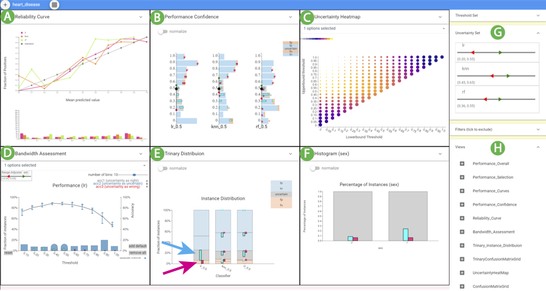

#  Overall Introduction

## Boxer
### Motivation
Machine learning practitioners often perform experiments that compare classification results. Users gather the results of different classifiers and/or data perturbations on a collection of testing examples. Results data are stored and analyzed for tasks such as model selection, hyper-parameter tuning, data quality assessment, fairness testing, and gaining insight about the underlying data. Classifier comparison experiments are typically evaluated by summary statistics of model performance, such as accuracy, F1, and related metrics. These aggregate measures provide for a quick summary, but not detailed examination. Examining performance on different subsets of data can provide insights into the models (e.g., to understand performance for future improvement), the data (e.g., to understand data quality issues to improve cleaning), or the underlying phenomena (e.g., to identify potential causal relationships). Making decisions solely on aggregated data can lead to missing important aspects of classifier performance. To perform such closer examination, practitioners rely on scripting and existing tools in their standard workflows. The lack of specific tooling makes the process laborious and comparisons challenging, limiting how often experiments are examined in detail.

### Main Contribution
Boxer is a comprehensive approach for interactive comparison of machine learning classifier results. It has been implemented in a prototype system. We show how Boxer enables users to perform a variety of tasks in assessing machine learning systems.

### Innovations
- The approach to classifier comparison that combines subset identification, metric selection, and comparative visualization to enable detailed comparison in classifier results.

- The architecture of multiple selections and set algebra that allows users to flexibly link views and specify data subsets of interest.

- Interactive techniques and visual designs that make the approach practical. These key ideas should be applicable in other systems for interactive comparison within complex data.

### Example of Boxer System

This figure shows how Boxer’s flexible mechanisms can be used to analyze whether a person will commit a crime within two years based on the data set contains 6,172 instances. Parallel Metrics view (A) shows the C3 classifier has better performance by all metrics. A histogram of race (F) selects Caucasian (cyan) and African-American (pink) instances. The Overall Performance view (B) shows C3's overall higher precision, but a lack of overlap with cyan. The Confusion Matrix (C) Grid view shows many false positives for African-Americans and many false negatives for Caucasians for C3. Histograms show the distribution of selected sets across the actual (D) and the C3-predicted class (E). The Performance Selection views in the third line compare accuracy (G) , precision (H) , and recall (I) for C3 on the subsets.

## CBoxer
### Motivation
Classifier assessment is more challenging when the result is continuously valued, rather than a discrete choice. Classification models often output a continuous valued score for their predictions. Sometimes, these scores are used directly to quantify the quality of the prediction. Even if the scores are ultimately thresholded to provide a binary decision, analysis of the scores can provide useful insights on classifier performance. Therefore, assessment must consider both correctness and score. Current methods address specific tasks. While these tools enhance the baseline of scripting within standard workflows, they do not extend to the diverse range of tasks users encounter, either by adapting to new situations or combining effectively to provide richer analyses.

### Main Contribution
CBoxer provides a more comprehensive approach using a combination of task-specific solutions and standard views and coordination mechanisms. It support the assessment of continuouslyvalued binary classifiers that is sufficiently flexible to adapt to a wide range of tasks.

### Innovations
- A set of views that support classifier assessment and allow flexible combination to perform detailed analyses.
- A set of design elements, such as trinary classification, that enable visualizations that readily adapt to interactive comparison.
- The mechanisms to discourage over-generalization.
- An example of how thinking in terms of comparison can enable the design of flexible tools that serve a variety of tasks, many of which may not obviously be comparison.

### Example of CBoxer 
 The CBoxer system assessing three classifiers for the disease prediction problem. (A) Reliability Curve view, (B) Performance Confidence view, (C) Uncertainty Heatmap view, (D) Bandwidth
Assessment view, (E) Trinary Distribution view, and (F) Histogram view. The Probability Control panel (G) and Views Control panel (H)
were used to configure the display. The user has selected the false positive (magenta) and uncertain (cyan) items for the LR classifier in
(E) as indicated by the arrows. These selections can be seen in other views, including (F) that shows that the classifier is more likely to be
uncertain for men.

<!-- |  Key idea| Boxer | CBoxer |
| -| ----------- | ----------- |
| Motivation | Machine learning practitioners often perform experiments that compare classification results. Users gather the results of different classifiers and/or data perturbations on a collection of testing examples. Results data are stored and analyzed for tasks such as model selection, hyper-parameter tuning, data quality assessment, fairness testing, and gaining insight about the underlying data. Classifier comparison experiments are typically evaluated by summary statistics of model performance, such as accuracy, F1, and related metrics. These aggregate measures provide for a quick summary, but not detailed examination. Examining performance on different subsets of data can provide insights into the models (e.g., to understand performance for future improvement), the data (e.g., to understand data quality issues to improve cleaning), or the underlying phenomena (e.g., to identify potential causal relationships). Making decisions solely on aggregated data can lead to missing important aspects of classifier performance. To perform such closer examination, practitioners rely on scripting and existing tools in their standard workflows. The lack of specific tooling makes the process laborious and comparisons challenging, limiting how often experiments are examined in detail.        | Classifier assessment is more challenging when the result is continuously valued, rather than a discrete choice. Classification models often output a continuous valued score for their predictions. Sometimes, these scores are used directly to quantify the quality of the prediction. Even if the scores are ultimately thresholded to provide a binary decision, analysis of the scores can provide useful insights on classifier performance. Therefore, assessment must consider both correctness and score. Current methods address specific tasks. While these tools enhance the baseline of scripting within standard workflows, they do not extend to the diverse range of tasks users encounter, either by adapting to new situations or combining effectively to provide richer analyses.
| Main Contribution   | Boxer is a comprehensive approach for interactive comparison of machine learning classifier results. It has been implemented in a prototype system. We show how Boxer enables users to perform a variety of tasks in assessing machine learning systems.    | CBoxer provides a more comprehensive approach using a combination of task-specific solutions and standard views and coordination mechanisms. It support the assessment of continuouslyvalued binary classifiers that is sufficiently flexible to adapt to a wide range of tasks.
|Innovations | <ul><li>The approach to classifier comparison that combines subset identification, metric selection, and comparative visualization to enable detailed comparison in classifier results.</li><li>The architecture of multiple selections and set algebra that allows users to flexibly link views and specify data subsets of interest.</li> <li>Interactive techniques and visual designs that make the approach practical. These key ideas should be applicable in other systems for interactive comparison within complex data. </li> </ul>. | <ul><li>A set of views that support classifier assessment and allow flexible combination to perform detailed analyses.</li><li>A set of design elements, such as trinary classification, that enable visualizations that readily adapt to interactive comparison.</li><li>The mechanisms to discourage over-generalization.</li><li>An example of how thinking in terms of comparison can enable the design of flexible tools that serve a variety of tasks, many of which may not obviously be comparison.</li></ul> -->

<!-- # Example of Boxer System

## Example image of original Boxer

This figure shows how Boxer’s flexible mechanisms can be used to predict whether a person will commit a crime within two years based on the data set contains 6,172 instances. Parallel Metrics view (A) shows the C3 classifier has better performance by all metrics. A histogram of race (F) selects Caucasian (cyan) and African-American (pink) instances. The Overall Performance view (B) shows C3's overall higher precision, but a lack of overlap with cyan. The Confusion Matrix (C) Grid view shows many false positives for African-Americans and many false negatives for Caucasians for C3. Histograms show the distribution of selected sets across the actual (D) and the C3-predicted class (E). The Performance Selection views in the third line compare accuracy (G) , precision (H) , and recall (I) for C3 on the subsets.

## Example image of CBoxer
 The CBoxer system assessing three classifiers for the disease prediction problem. (A) Reliability Curve view, (B) Performance Confidence view, (C) Uncertainty Heatmap view, (D) Bandwidth
Assessment view, (E) Trinary Distribution view, and (F) Histogram view. The Probability Control panel (G) and Views Control panel (H)
were used to configure the display. The user has selected the false positive (magenta) and uncertain (cyan) items for the LR classifier in
(E) as indicated by the arrows. These selections can be seen in other views, including (F) that shows that the classifier is more likely to be
uncertain for men. -->
