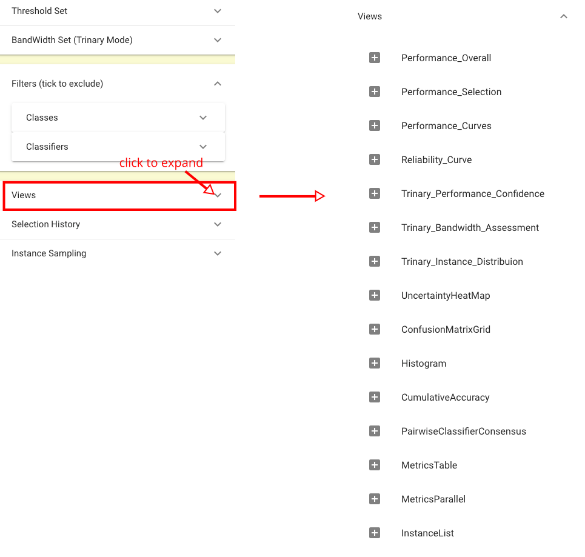
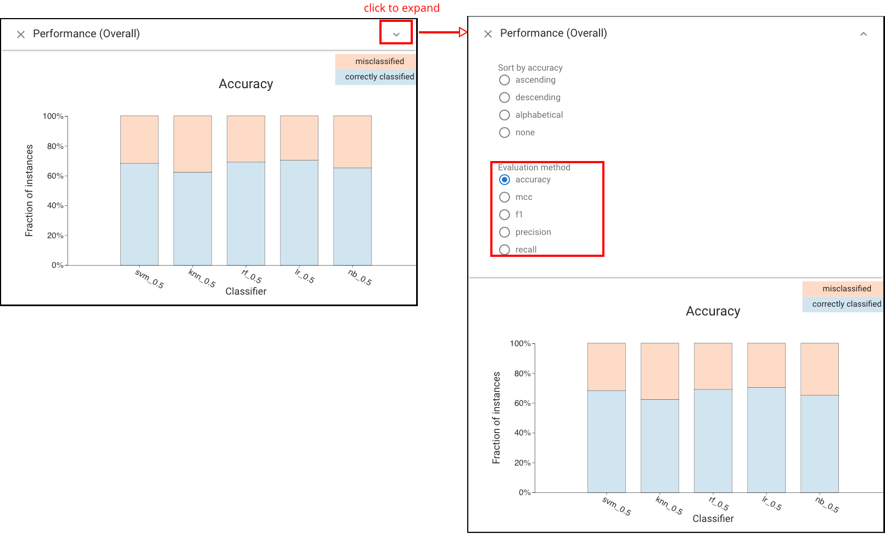
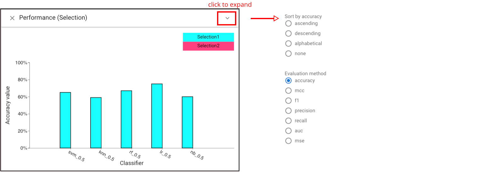

#  Get started

The tutorial will introduce the ways of comparing classfiers' performance. It will guide you to load data, choose views and analyze visualizations. 

**1. Load dataset**

Click the '+' at top left to choose the dataset (we use the 'wine_quality' dataset for this tutorial). 

**2. Compare classifiers based on overall performance**

There are multiple ways to compare the accuracy of each classifier. We can directly use *Classifier Performance View*, where each bar is composed of the correctly classified instances (represented by the blue bar at the bottom) and misclassified instances (represented by the orange bar on top). To get the exact value of accuracy, we can hover on each bar, then the fraction of correctly classified and misclassified instances will show up. 

We can also use other views to get such information. In order to choose other views, we could expand the 'Views' panel in the left. 

For accuracy comparison, we can also use *Standard Metrics view* and *Parallel Metrics view*.

Apart from accuracy, we can also comapre classifiers based on other metrics, including *precision, recall, f1, mcc*. For example, we can expand the panel of *Classifier Performance View* to choose the metrics we want. 

**3. Compare classifiers based on selected subset**

Now we already have a sense the overall performance of each classifier under the entire dataset, and we might want to focus on the comparisons based on the selected subset. Supposed that we are interested in the performance of each classifier in the 'red wine' instances. 

First, we can create the subset by using the *Histogram view*. Let's expand the panel and choose 'type' in the dropdown menu of 'Categorial'. Then click the bar of 'red' to make the selection.
. 

Now the selected instances can be showed in all the bars of the system. To directly compare the performance of classifiers under the selected subset, we could use 'Selection Performance view' where displays the accuracy (we can also choose other metrics by expanding the panel of the view) of each classifier based on the selected instances. 
. 
