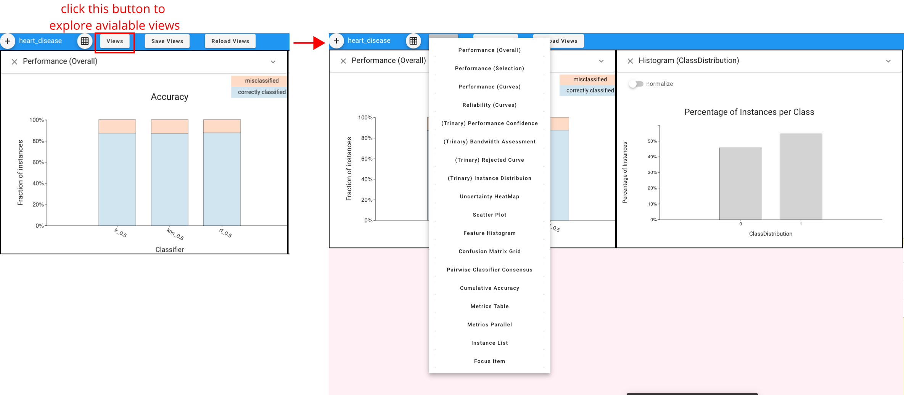
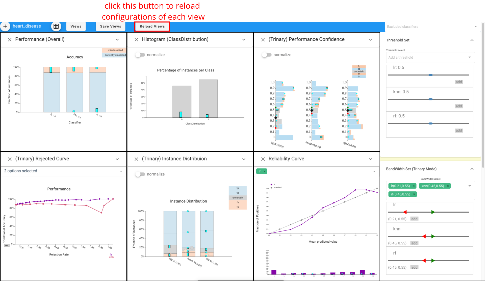

# Additional guide for views manipulation

This tutorial will walk through some basic usages of Boxer system, like how to make views, save / reload views configuration.

### Make views

### Save and reload configuration
Clicking the "Save Views" button enables us to save the configurations of current views. After clicing the button, a "views_config.json" file will be created and it contains the important configurations of all views, including the view's mode, the selected options in each view, the thresholds of classifiers, etc. 

Supposed we happen to close the Boxer web site and want to resume all views and configurations saved before, we could click the "Reload Views".  

<!-- ### Resume configuration (for use datasets provided by the system) -->