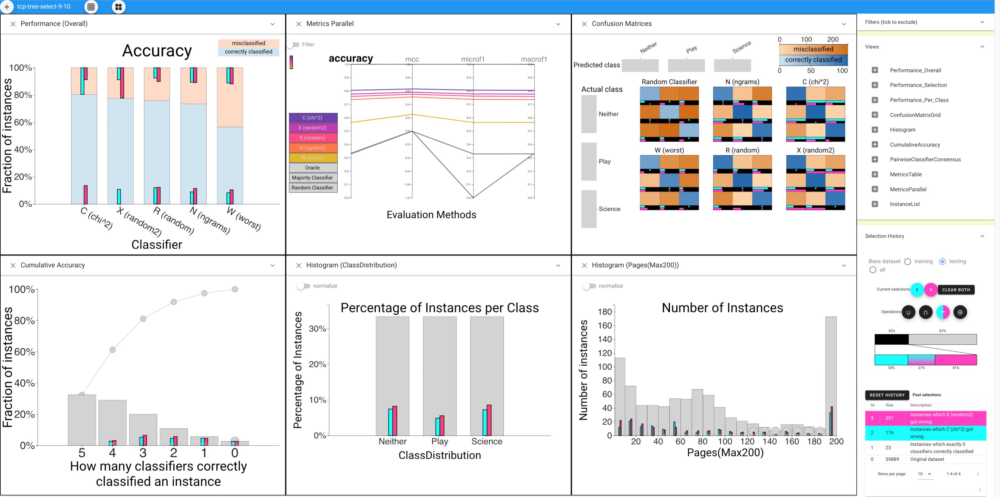

# Boxer: Interactive Comparison of Classification Results

This site has a brief [introduction](), [videos](), an [online demo](), and the beginnings of a [user guide](). 

## Boxer
Boxer is a system for comparing the results of machine learning classifiers. Please see the [EuroVis 2020 paper](https://graphics.cs.wisc.edu/Papers/2020/GBYH20/) for a description. 
The Boxer system is available open source. The source repository is [on GitHub](https://github.com/uwgraphics/boxer-release/). However, if you just want to use the system, the [demo is available online]().
 

## CBoxer
<!-- The original system (Boxer) focuses on comparing discrete choice classifiers by identifying subsets of instances where the performance is interesting.  -->
Besides Boxer, a continuous Boxer system (CBoxer) has been proposed to provide an approach to assessment of continuously-valued binary classifiers that is sufficiently flexible to adapt to awide range of tasks. It focuses on comparison as a strategy, enabling the approach to support the wide range of tasks encountered by practitioners. Tasks are framed as comparison, either between models or among subsets of items, providing a common basis.

 

 We are also in the process of extending Boxer to handle other types of machine learning problems and we are trying to make the system easier to use through documentation and a guidance system. 

*Acknowledgements:This work was in part supported by NSF award 1830242 and DARPA FA8750-17-2-0107.*
