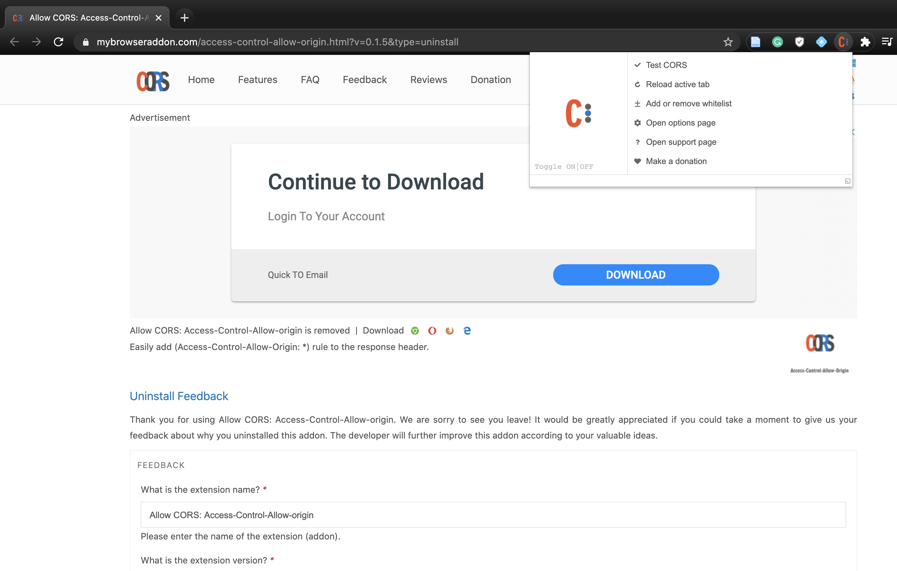
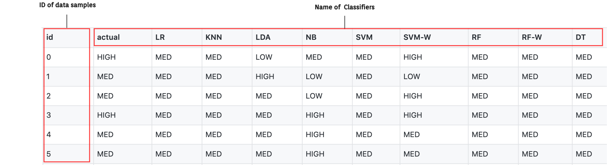
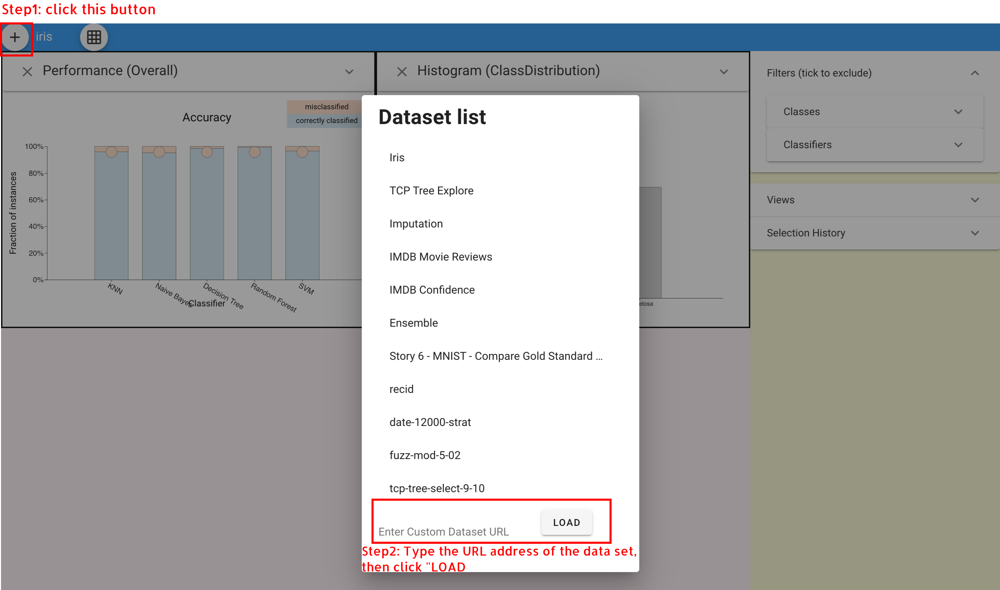

# Instructions to prepare your own data for Boxer
### CORS
In order to successfully load your dataset, you need to first add an extension called [CORS](https://chrome.google.com/webstore/detail/allow-cors-access-control/lhobafahddgcelffkeicbaginigeejlf?hl=en-US )  (Access-Control-Allow-Origin lets you easily perform cross-domain Ajax requests in web applications) to Chrome. 

Everytime you want to use your own dataset, please remember to enable 'CORS'.


### Data Set Composition
The data set used for Boxer consists of 3 files:

- **results.csv**: This file contains the **prediction results** of each classifier on each instance, where each row represents the *id* of the data sample and each column represents the *name of the classifier*.


- **features.csv**: 
This file displays the **features** of each instance, where each row represents the *id* of the data sample and each column represents the *name of each feature*.


- **manifest.json**: 
This file is the configuration of the data set, which helps Boxer system to read and load the data set.
 ```
 {
  "datasetName": "IMDB 5000 dataset",  // name of the data set
  "classes": [                         // array including the names of classes
    "HIGH",
    "MED",
    "LOW"
  ],
  "classifiers": [                     // array including the names of classifiers 
    "LR",
    "KNN",
    "LDA",
    "NB",
    "SVM",
    "SVM-W",
    "RF",
    "RF-W",
    "DT"
  ],
  "features": {                       // dict including the detailed information of each feature: "type", "description", "categories"(optional), "bounds"(optional)
    "train_or_test": {               
        "type": "categorical",
        "categories": [
            "train",
            "test"
        ],
        "description": "whether instance was used for training or testing"
    },
    "movie_title": {
      "type": "nominal",
      "description": "title"
    },
    "title_year": {
      "type": "interval",
      "description": "year released"
    },
    "content_rating": {
      "type": "ratio",
      "description": "content rating",
      "bounds": [ 0.0, 1.0 ]
    },
  }
}
 ```
   
### Load Data into Boxer



