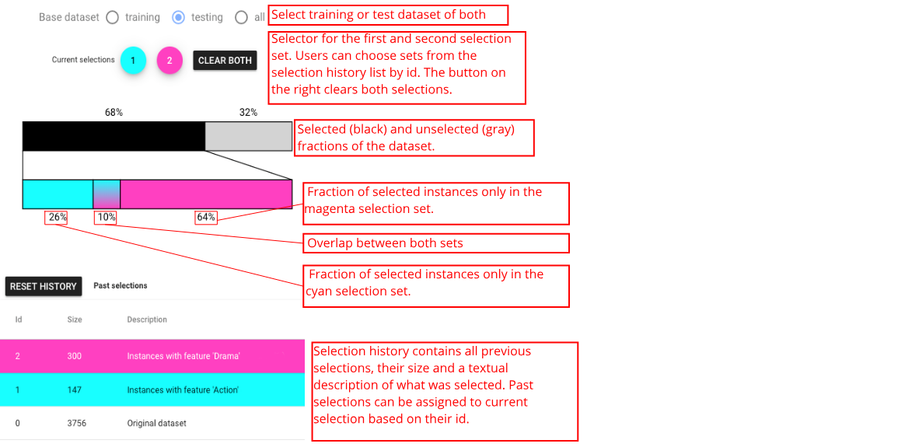
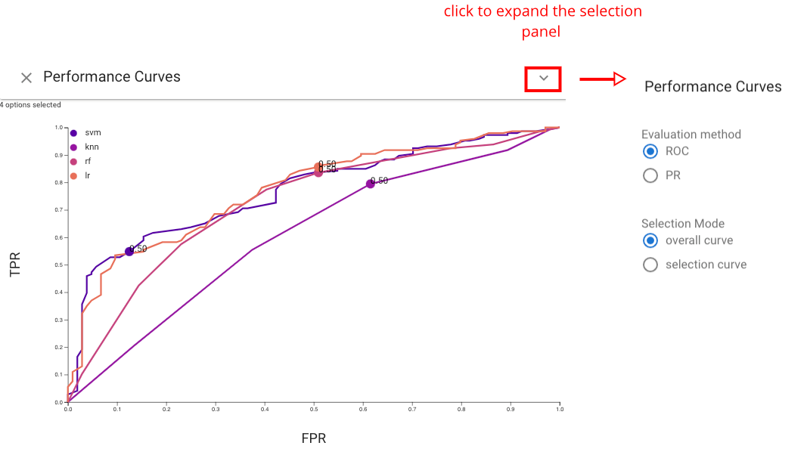
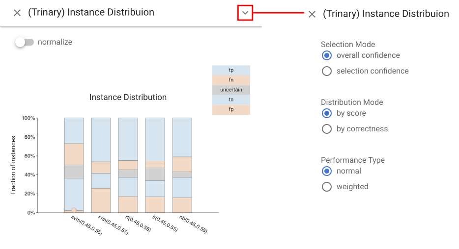

#  Description of views

## Overview of Boxer Views
Boxer features a number of different views that provide often needed arrangements of boxes useful in performing classifier comparison. This part will provide you with an overview of the views in Boxer. You will learn the basic uses of each view.

To add a view to the workspace, use the **Views** dropdown in the right panel of Boxer's window. It is below the "filters" panel. 

To see examples of how the views are used in analysis scenarios, see the [use cases]().

### Classifier Performance View

The **Classifier Performance view**: shows the performance of each classifier in a stacked bar. A variety of metrics can be chosen. For metrics that are ratios of subset counts (e.g., accuracy, precision, and recall), the bars are stacks of boxes. This view provides a simple overview of classifier performance, and an easy way to select sets of instances (e.g., what classifier predicts correctly). The view allows sorting by value to facilitate identification and comparison of the best or worst classifiers.

### Histogram View
The **Histogram view** shows the distribution of the data across a feature. This includes the data features as well as the actual and predicted classes. Users can choose to show different distributions. Continuous features are bucketed, and categorical features can also be chosen. Histograms provide an important mechanism for selection as well as comparative display, as bars serve as boxes.

### Cumulative Accuracy view
The **Cumulative Accuracy view** shows how many classifiers correctly labeled each data instance. This view can be used to select challenging instances, or to see if a selected set contains easy items.

### Selection and Per-Class Performance Views
The **Selection Performance view** (left)  shows the performance of each classifier across both selections. A variety of different metrics can be chosen (accuracy, F1, etc.). The **Per-Class Performance view*& (right) shows the performance of each classifier for each of the actual classes of the instances. 

### Confusion Matrix Grid View
The **Confusion Matrix Grid view** provides the standard view of classification results for each classifier. It can be used to compare classifiers based on their prediction profile per class. Three additional matrices are also provided by Boxer and serve as a comparison baseline: the oracle, shows the performance of a perfect classifier; the majority classifier, predicts the majority class in the dataset; the random classifier, predicts a random class for each instance.

### Pairwise Consensus View
The **Pairwise Consensus view** shows the agreement and disagreement between each pair of classifiers as a matrix. It conveys the number of instances for which two classifiers predict the same label. The matrix is split on the diagonal to distinguish agreement on correct vs. incorrect instances. This view can be used to identify correlations between classifiers.

### Standard Metrics and Parallel Metrics Views

The Standard Metrics view and Parallel Metrics view provide overall statistics about the classifiers. The **Standard Metrics view** (left) provides a simple table of many metrics across all classifiers. The **Parallel Metrics view** (right) presents the same information in a parallel coordinates chart, which can identify correlation between metrics. 

### Instance List View
The **Instance List view** shows a tabular display of the instances in the active selections. Instances are color-coded to indicate which selections they are part of. Single instances can be selected as the selection in this view, which  allows for fine-grained, instance-level modification of selections.

### Selection Controls Panel

The **Selection Controls panel** can support selection display and interaction, as well as allows users to switch between training set, selection set, or both. *Selection* is a subset of instances of interest to the user. In Boxer, boxes serve to create selections (e.g., clicking on a box sets the active selection), and the active selection can be presented visually in each box to enable comparison by showing the intersection between the box and the selection. The left and right mouse buttons are used to make the first and second selections separately. Consistent coloring is used throughout the interface: cyan represents the first active selection, magenta the second.

  

 ## Extra views designed for CBoxer

 **The following views are included in CBoxer (Continuous Boxer)** .

### Performance Curves view
The **Performance Curves view** shows  the  performance of each classifier based on a line chart.  Either Receiver Operator Characteristic (ROC) curve or Precision-Recall (PR) curve can be chosen by users based on their preference. This view helps users assess model performance via traditional summary statistics and graphs, and also allows users to see how the number of correctly classified positive samples varies with the number of incorrectly classified negative samples. In addition to provide summary statistics of classifiers, this view also enables users to set threshold by clicking any point on curves. The changes of threshold will also be showed on other views.

### Reliability Curve view
The **Reliability Curve view** provides the information of how the predicted probabilities of each classifier match the expected distribution of probabilities for each class . The x axis in this view represents the average predicted probability in each bin, then the y axis is the fraction of positives. The more reliable a forecast, the closer the points will appear along the  main diagonal from thebottom left to the top right of the plot. The Reliability Curve view and Performance Confidence
view both help assess the calibration. The former
allows for quick comparison, while the latter integrates information
about the amounts and allows for selection.

### Trinary Performance Confidence view
The **Trinary Performance Confidence view** shows a histogram
(bar chart) of the number of items for each binned level of score. Stacked bars are used to show different classifications at each
level. This basic design of using a position encoding for score level and color for correctness. Also,  we use a vertical design to make better use of space when juxtaposing multiple classifiers for comparison.We bin the items (rather than providing individual marks to scale to large collections of items. The stacked bar charts divide the actual class into areas; the prediction is encoded by position relative to the threshold. Our current design uses colors for correct and incorrect: negative/positive must be inferred by position relative to the threshold. Experiments with separate colors led to an even more busy display.

### Trinary Bandwidth Assessment view
The **Trinary Bandwidth Assessment view** summarizes the performance
of a classifier over a range of thresholds and bandwidths.
The top graph shows a line graph of accuracy as threshold changes.
Three bandwidths are selected for comparison, each is assigned a
color. The error-bar-like glyphs show the range of accuracy possible
with the different bandwidths depending on how one interprets
rejected items. The top of the bar considers rejected items as correct, the bottom as incorrect. The bar chart at the bottom shows the number of rejected items with circles to enable easier selection.

### Trinary Instance Distribution view
The **Trinary Instance Distribution view** provides
a summary of the classification decisions for given threshold values, allowing for assessment of a threshold setting. The standard
confusion matrix does not work as there is a 5th category (rejected
items). Instead, the design uses a stacked bar design to allow for
comparison between classifiers. To enable different comparisons
against common baselines, the ordering of the stacked elements can
be changed. Correctness mode groups right and wrong answers,
while score mode groups positive and negative predictions.

### Uncertainty Heatmap view
The **Uncertainty Heatmap view** shows performance for all values of upper and lower thresholds simultaneously. Thresholds are mapped to position, a performance metric (e.g., accuracy or recall) is mapped to color, and the percentage of non-rejected items is mapped to radius. Settings that reject many items are less salient - even if they have favorable colors. Hovering over a circle exposes the numerical values for all metrics. The view allows for quick identification of favorable ranges in terms of performance, while considering rejection rate.

### Rejection Curve view
The **Rejection Curve view** shows the Accuracy-Rejection Curve (ARC) which plots performance against rejection rate (percentage of items rejected), providing access to the threshold levels for different rates of rejection. The Rejection Curve view extends standard ARCs by permitting the use of a variety of metrics beyond accuracy to help the user understand performance trade-offs.
It can display multiple curves to allow for comparison between
classifiers, different decision threshold levels, or different subgroups.

### Focus Item view
In addition to selection 1 (cyan) and 2 (magenta), the system also introduces the notion of **Focus Items**. A Focus Item is a single data point of interest in the dataset.
The **Focus Item View** provides a way to select Focus Items and examine them. With the help of this view, you can traverse through the entire dataset, or through a subset selected using the dropdown menu. You may also look up random data points. The Focus Item View shows all the details of a data point, including images.  
Note that a focus item appear in other views as a yellow dot. You may find the **"EMPHASIZE"** button in the **Focus Item View** helpful when the focus dots are too small.

<!-- 
### Threshold Controls panel 

### Bandwidth set panel -->
